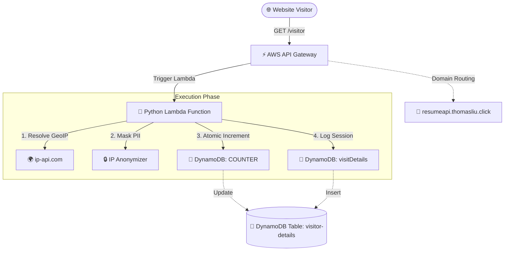

# AWS Cloud Resume Challenge — Backend

This repository hosts the backend for the [Cloud Resume Challenge](https://cloudresumechallenge.dev/)—a serverless, cloud-native API designed to count and analyze traffic to the personal resume page. Built with **Python 3.13** and **AWS SAM (Serverless Application Model)**, it captures visitor metadata (browser, OS, anonymized IP, and geographic region) securely and efficiently, serving it via a custom domain.

[](https://github.com/thomas-s-liu/cloud-resume-challenge-backend/actions)
[](https://www.python.org/)
[](https://aws.amazon.com/serverless/sam/)
[](https://github.com/astral-sh/ruff)
[](https://github.com/PyCQA/bandit)

---

## 🛠️ System Architecture

The application is fully serverless, optimized for the AWS Free Tier, and secured against traffic surges through strict rate-limiting policies.



### Request Flow
1. **API Gateway Trigger**: When a client requests `https://resumeapi.thomasliu.click/visitor`, API Gateway rate-limits the query and routes it to the Lambda.
2. **Metadata Capture & Geolocation**: The Python Lambda extracts the client's public IP from request headers and geolocates it using `ip-api.com`.
3. **Data Anonymization**: The IP address is immediately anonymized (masked) to respect visitor privacy laws (e.g., GDPR, CCPA).
4. **Atomic Transaction**: The function atomically increments the visitor counter and records a granular log record (UUID-indexed) containing browser, operating system, timestamp, and geographic details in DynamoDB.

---

## ⚙️ Core Technical Implementation

### 1. Atomic Distributed Counting
To guarantee data integrity across simultaneous page loads, the system avoids "read-then-write" race conditions. Instead, it utilizes DynamoDB **Atomic Updates** (`ADD` expression):

```python
response = ddbClient.update_item(
    TableName=table_name,
    Key={'visitId': {'S': 'COUNTER'}},
    UpdateExpression='ADD visitCount :incr SET lastUpdated = :ts',
    ExpressionAttributeValues={
        ':incr': {'N': '1'},
        ':ts': {'S': current_timestamp}
    },
    ReturnValues='ALL_OLD'
)
```
* **Synchronization Safe**: If the global `COUNTER` record does not exist yet, the function catches the validation error, executes a concurrent-safe initial `put_item` with a conditional expression `attribute_not_exists(visitId)`, and restarts the counter loop gracefully.

### 2. Privacy-Compliant Analytics (PII Protection)
To build responsibly in the public cloud, the backend enforces privacy-by-design principles:
* **IPv4 Anonymization**: All IPv4 addresses are masked to a `/16` subnet (e.g., `203.0.113.42` becomes `203.0.0.0`) before writing to persistent storage.
* **IPv6 Anonymization**: IPv6 addresses are truncated to their leading three blocks (e.g., `2001:0db8:85a3:0000:0000:8a2e:0370:7334` becomes `2001:0db8:85a3::`).
* **User-Agent Parsing**: Browser and OS classification are completed entirely in-memory using lightweight regex rules, preventing the exposure of detailed client footprints.

---

## 📂 Project Directory Structure

```text
├── .github/workflows/     # GitHub Actions CI/CD workflows
│   └── deploy.yml         # Continuous Delivery pipeline (Manual & automated)
├── docs/                  # Project documentation assets
│   └── aws-sam-template-readme.md   # Archived AWS SAM boilerplate guide
├── events/                # Mock event templates for local SAM invokes
│   └── event.json         # API Gateway HTTP GET mock event
├── requirements/          # Environment-specific package manifests
│   ├── base.txt           # Production dependencies (boto3, requests, etc.)
│   ├── dev.txt            # Static code analysis tools
│   └── test.txt           # Testing engine (pytest, moto, responses)
├── visitor/               # Core Lambda application codebase
│   ├── __init__.py
│   └── app.py             # Event Handler, Geolocation and DynamoDB clients
├── tests/                 # Comprehensive test suites
│   ├── unit/              # Mocked tests (moto, local execution)
│   └── integration/       # Real-cloud testing (targets live AWS deployment)
├── pyproject.toml         # Tooling configurations (Ruff, Pytest, Mypy, Bandit)
├── template.yaml          # AWS SAM infrastructure definition template
└── samconfig.toml         # Local AWS SAM execution properties
```

---

## 🛠️ Infrastructure Configuration (`template.yaml`)

The serverless stack is managed via Infrastructure-as-Code (IaC) in `template.yaml`.

### 1. Resource Allocations
* **Lambda Runtime**: Python 3.13 (`arm64` architecture for 30%+ better cost-to-performance efficiency over standard x86).
* **Environment Variables**:
  * `tableName`: Points dynamically to the DynamoDB Table resource (`visitor-details`).
  * `startingVisitNumber`: Set to `'700'` to initialize or pad the counter at a professional milestone.

### 2. API Gateway & Throttling
To protect the backend against Denial-of-Service (DoS) vectors, the implicit production stage enforces strict API Gateway limits:
* **Throttling Burst Limit**: 100 concurrent requests.
* **Throttling Rate Limit**: 50 requests per second.

### 3. DynamoDB Table Schema (`visitor-details`)
* **Billing Mode**: `PAY_PER_REQUEST` (On-Demand billing, optimizing costs to absolute zero when the site has no traffic).
* **Hash Key**: `visitId` (String UUID).
* **Global Secondary Index (GSI)**: `TimestampIndex` (Partitioned by `timestamp` for high-throughput temporal queries).
* **Security & Reliability**: 
  * `SSEEnabled: true` (AWS-managed server-side encryption).
  * `PointInTimeRecoveryEnabled: true` (Automated rolling backups).

### 4. Custom Domain Routing
Uses an `AWS::ApiGatewayV2::ApiMapping` resource to associate the implicit serverless API to:
```text
resumeapi.thomasliu.click
```

---

## 💻 Local Development & Quality Assurance

This codebase is configured with strict quality gates, verifying security, types, and styles prior to production deployments.

### 1. Local Environment Setup
Ensure Python 3.13 is installed locally. Set up a virtual environment and load dependencies:

```bash
# Initialize and activate the virtual environment
python -y -m venv .venv
source .venv/bin/activate

# Install development & test dependencies
pip install -r requirements/dev.txt
```

### 2. Static Analysis & Linting Gates
Before submitting code changes, run the following tools to satisfy linting and typing requirements:

```bash
# Code formatting and style checks (Ruff)
ruff check .
ruff format . --check

# Strict type verification (Mypy)
mypy visitor/

# Static security scanning (Bandit)
bandit -r visitor/ -c pyproject.toml

# Dependency vulnerability scanning (Pip-audit)
pip-audit
```

### 3. Executing the Test Suite
The codebase is split into isolated Unit and Integration test patterns using `pytest`.

#### A. Unit Tests (Fast & Mocked)
Unit tests utilize `moto` to emulate DynamoDB in-memory and `responses` to intercept external HTTP geolocation requests. They run instantly without communicating with AWS:

```bash
# Run all unit tests with verbose output
pytest -v tests/unit/
```

#### B. Integration Tests (Live Environment)
Integration tests communicate with your live deployed AWS stack. They perform live HTTP requests to the target gateway and query the real DynamoDB tables to verify behavior in realistic conditions.

> [!WARNING]
> Running integration tests requires a deployed AWS stack. Ensure your environment has valid AWS credentials configured.

```bash
# Run integration tests against your live AWS stack
pytest -v tests/integration/
```
> [!NOTE]
> The integration tests automatically read output variables from the CloudFormation stack named `VisitorApi` (which maps to your deployed stack) to locate your API Gateway endpoint dynamically.

---

## 🚀 Build & Deployment

### 1. Manual Deployment (SAM CLI)
To deploy changes from your local workspace manually:

```bash
# 1. Build the SAM template inside a Docker container
sam build --use-container

# 2. Deploy to AWS CloudFormation (guided configuration on first run)
sam deploy --guided
```
Subsequent manual updates can be deployed directly by running `sam deploy` once `samconfig.toml` has captured your preferences.

### 2. Automated CI/CD Pipeline (GitHub Actions)
Deployments are fully automated via GitHub Actions (`.github/workflows/deploy.yml`). 

The pipeline runs on **GitHub Action's Ubuntu Runners** and can be kicked off via `workflow_dispatch` (manual trigger).

#### Pipeline Steps:
1. **Checkout & Environment Init**: Pulls codebase and initializes Python 3.13 runtime with pip-cache configured.
2. **SAM Configuration**: Installs and boots up the `aws-actions/setup-sam` environment.
3. **AWS Authentication**: Securely authenticates using OpenID Connect (OIDC) or stored GitHub Secrets (`AWS_ACCESS_KEY_ID`, `AWS_SECRET_ACCESS_KEY`).
4. **SAM Build**: Packages the lambda code with dependencies.
5. **SAM Deploy**: Deploys the infrastructure changes directly to the `visitor-api` CloudFormation stack under the default `us-east-1` region with IAM capabilities confirmed.

---

## 🧹 Maintenance & Logging

### Reading Logs in Production
To tail live execution logs for the Lambda function in the AWS cloud directly from your command line:

```bash
sam logs -n VisitorLambdaFunction --stack-name visitor-api --tail
```

### Cleanup
If you need to tear down the AWS resources generated by this project, execute the CloudFormation deletion command:

```bash
aws cloudformation delete-stack --stack-name visitor-api
```
